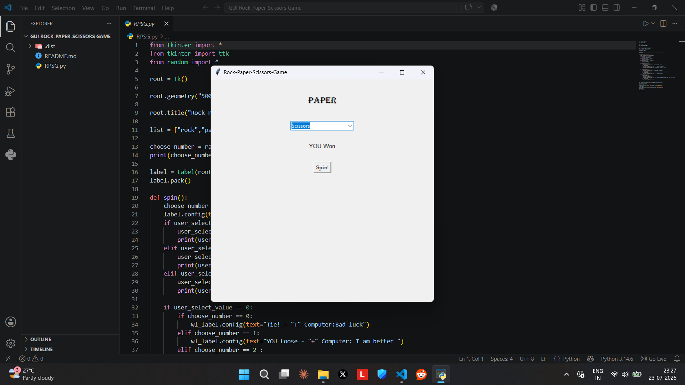

<h1>Rock Paper Scissors Game GUI<h1>
  
 <h3>Import Required Library<h3>
   <ul>
   <h5>from tkinter import *</h5>
   <h5>from tkinter import ttk</h5>
     <h5>from random import *</h5></ul>
   
Select Rock Paper or Scissors and click on spin the top label shows whos turn it is and botton label shows who won either computer or you. 

 

And that's it. Congratulations You have built your First Rock-Paper-Scissors GUI Game
 in python👏👏

